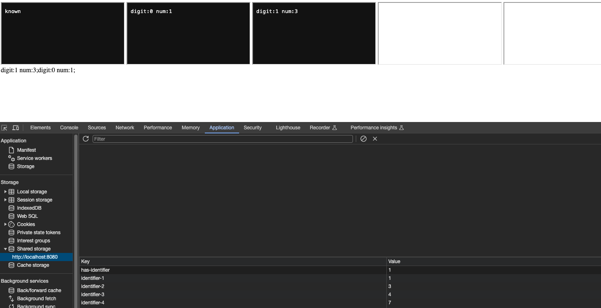
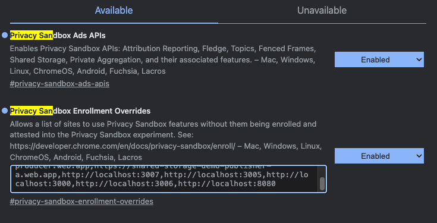

# Deprivacy Sandbox

## Introduction

This research aims to broke privacy sandbox.

## Entropy based attack

First attempt was to abuse selecturl and shared state to identify user cross site. But no luck. There is budget mechanism to prevent abuse. <https://github.com/WICG/shared-storage?tab=readme-ov-file#budgeting>

- Latest result is extracting 4 bits of information to local storage by using navigation budget.

## Time based attack

Entropy based attack has budget problem when log2(urls) bigger then 0 as we can run sleep in worklets, we can use time to extract information. Passing single url means log2(1 url) = 0. We can use this to extract information without any budget

