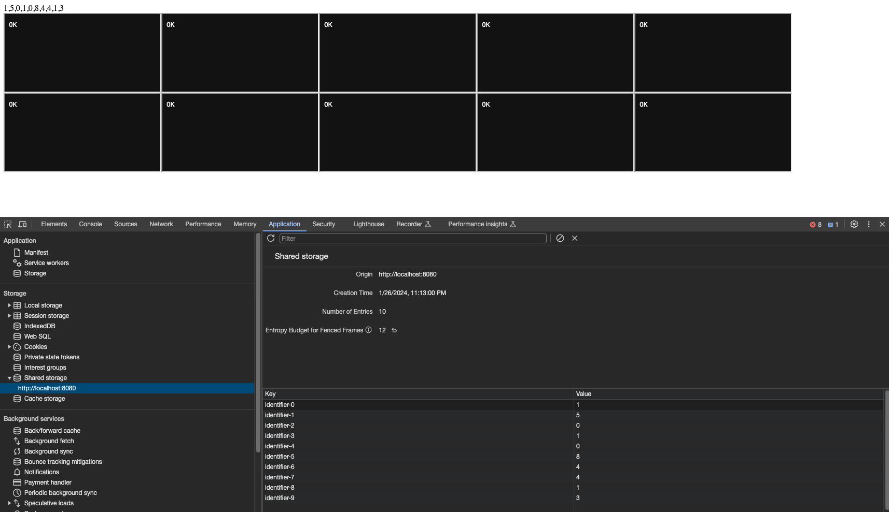

# Deprivacy Sandbox

## Introduction

This research aims to broke privacy sandbox. It seems we can extract small bits of info with entropy attack and unlimited with timing attacks. These techniques can be combined for more effective results.

## Entropy based attack

First attempt was to abuse selecturl and shared state to identify user cross site. But no luck. There is budget mechanism to prevent abuse. <https://github.com/WICG/shared-storage?tab=readme-ov-file#budgeting>

- Latest result is extracting 4 bits of information to local storage by using navigation budget.

## Time based attack

Entropy-based attack faces budget issues when log2(urls) is greater than 0. As we can run sleep in worklets, we can utilize time to extract information. Passing a single URL means log2(1 URL) = 0. We can use this method to extract information without any budget constraints.

