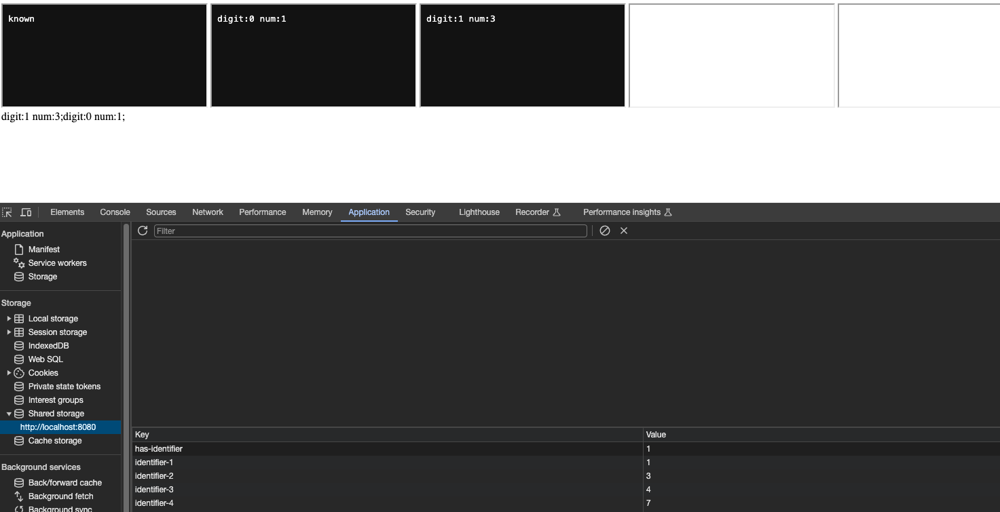

# Deprivacy Sandbox

## Introduction

This research aims to broke privacy sandbox.
First attempt was to abuse selecturl and shared state to identify user cross site. But no luck. There is budget mechanism to prevent abuse. <https://github.com/WICG/shared-storage?tab=readme-ov-file#budgeting>

- Latest result is extracting 4 bits of information to local storage by using navigation budget.
